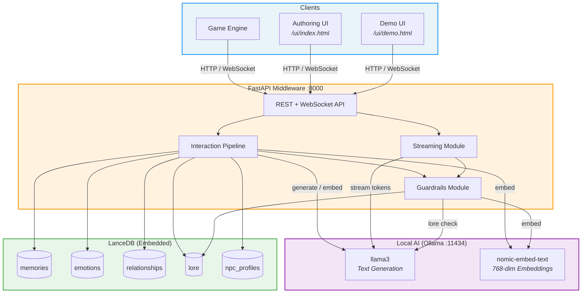
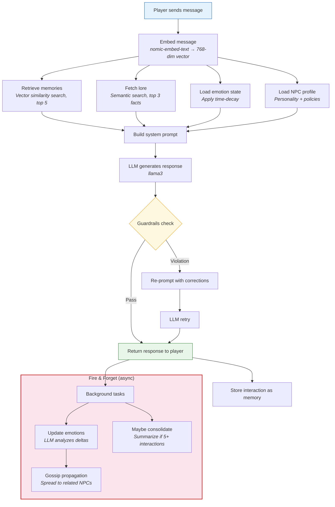
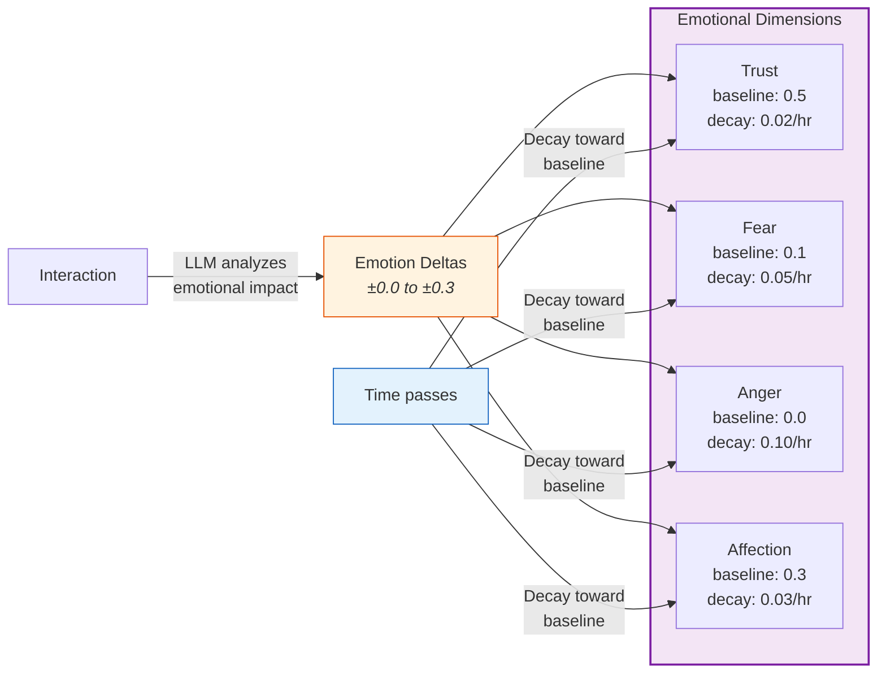
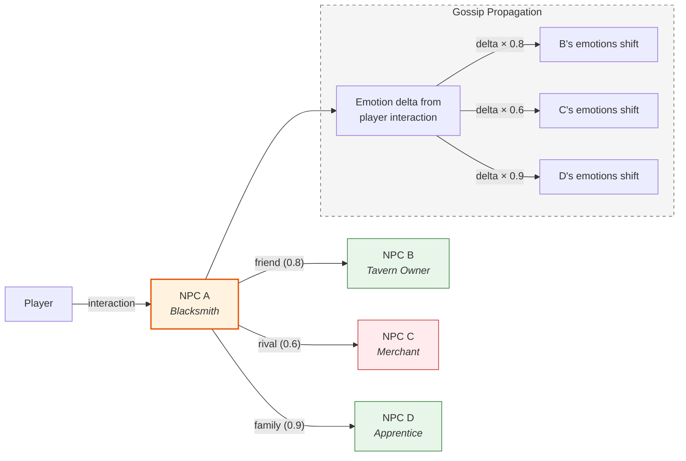
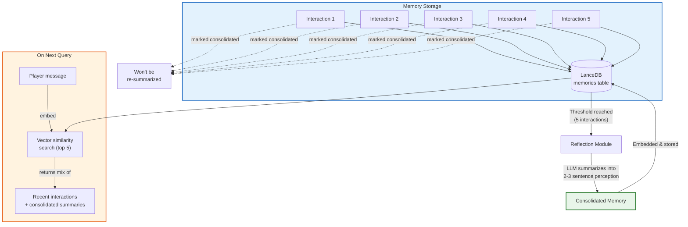
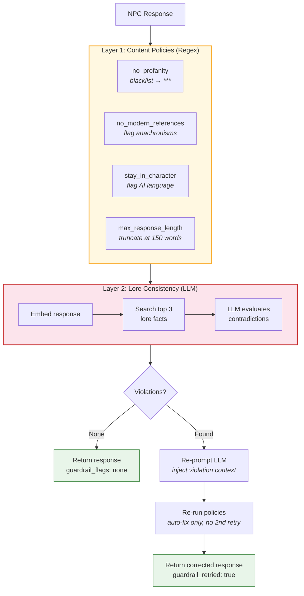
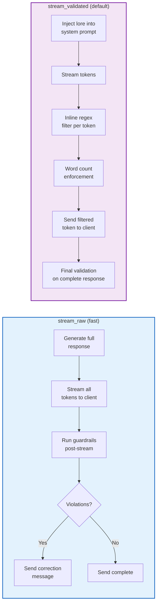
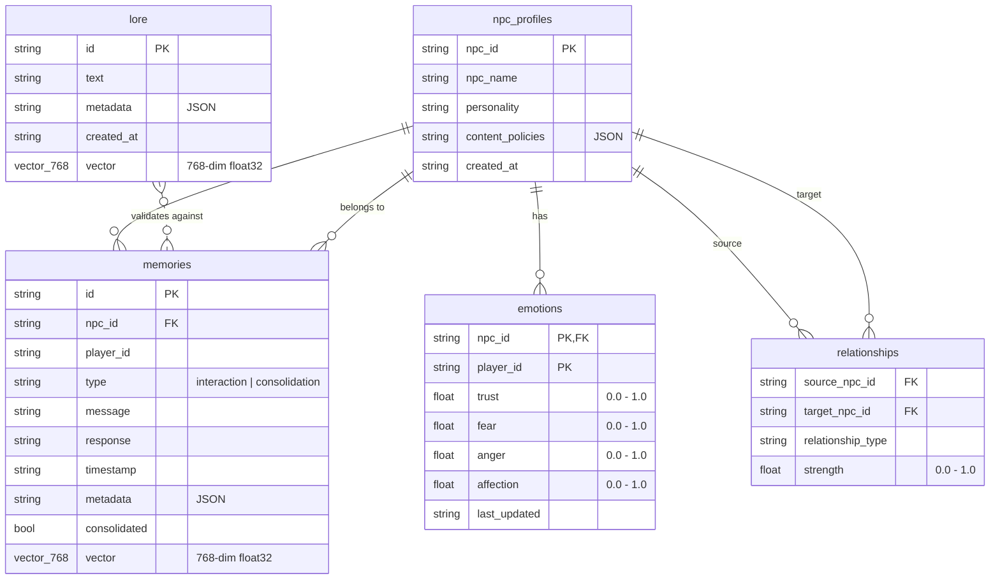
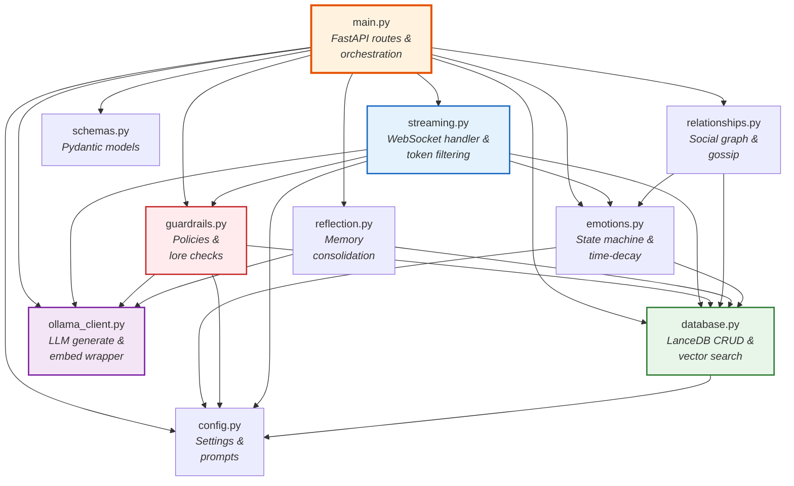
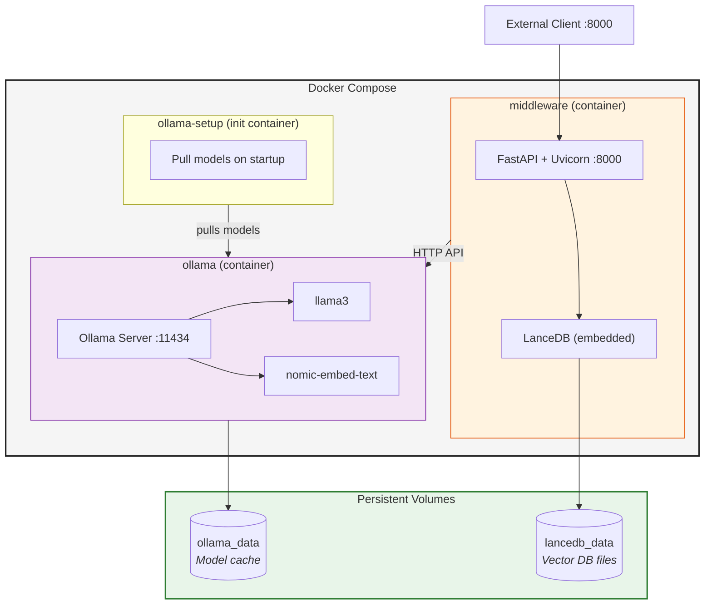

# NPC Memory Middleware - Architecture

> A headless AI middleware that gives game NPCs persistent memory, emotions, relationships, and personality - all running locally.

---

## System Overview

---

## Interaction Processing Pipeline

The core flow when a player talks to an NPC:

---

## Emotion System

NPCs have four emotion dimensions per player, each with independent decay rates:

---

## Social Graph & Gossip Propagation

When an NPC's emotions change, related NPCs are influenced:

> Propagation only fires when the total magnitude of deltas >= 0.1, preventing noise.

---

## Memory Lifecycle

---

## Guardrails Pipeline

Multi-layer content validation with auto-correction:

---

## WebSocket Streaming Modes

---

## Database Schema

---

## Module Dependency Map

---

## Deployment Architecture

---

## API Endpoint Map

| Method | Endpoint | Description |
|--------|----------|-------------|
| `GET` | `/npcs` | List all NPC profiles |
| `POST` | `/npc/profile` | Create or update an NPC |
| `PATCH` | `/npc/{id}/policies` | Update content policies |
| `POST` | `/interact` | Synchronous NPC interaction |
| `WS` | `/interact/stream` | Streaming NPC interaction |
| `GET` | `/npc/{id}/emotions/{player_id}` | Get emotional state |
| `POST` | `/npc/relationship` | Create NPC relationship |
| `GET` | `/npc/{id}/relationships` | List NPC relationships |
| `DELETE` | `/npc/relationship` | Remove relationship |
| `POST` | `/lore` | Add world lore entry |
| `GET` | `/lore` | List all lore entries |

---

## Tech Stack

| Layer | Technology | Purpose |
|-------|-----------|----------|
| **API** | FastAPI + Uvicorn | Async HTTP/WebSocket server |
| **LLM** | Ollama (llama3) | Local text generation |
| **Embeddings** | Ollama (nomic-embed-text) | 768-dim vector embeddings |
| **Vector DB** | LanceDB | Embedded similarity search |
| **Validation** | Pydantic v2 | Request/response schemas |
| **Serialization** | PyArrow | LanceDB data structures |
| **Deployment** | Docker Compose | Multi-container orchestration |
